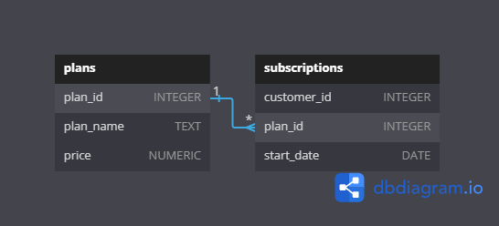
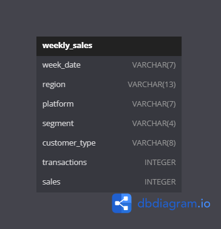

# SQL Case Studies

This repository contains my solutions for the **SQL Case Studies**. The repository consists of eight case studies designed to enhance SQL skills by solving real-world business problems. Each case study includes detailed scenarios and datasets to analyze.

## Table of Contents

1. [Case Study #1: Danny's Diner](#case-study-1-dannys-diner)
2. [Case Study #2: Pizza Runner](#case-study-2-pizza-runner)
3. [Case Study #3: Foodie-Fi](#case-study-3-foodie-fi)
4. [Case Study #4: Data Bank](#case-study-4-data-bank)
5. [Case Study #5: Data Mart](#case-study-5-data-mart)
6. [Case Study #6: Clique Bait](#case-study-6-clique-bait)
7. [Case Study #7: Balanced Tree Clothing Co.](#case-study-7-balanced-tree-clothing-co)
8. [Case Study #8: Fresh Segments](#case-study-8-fresh-segments)

---

## Case Study #1: Danny's Diner

**Scenario:** Help Danny analyze his restaurant's performance and customer behavior. 

**Focus Areas:**
- Customer segmentation
- Revenue analysis
- Frequency of visits

---

## Case Study #2: Pizza Runner

**Scenario:** Analyze and optimize the delivery process for a pizza delivery company.

**Focus Areas:**
- Delivery metrics
- Performance improvements
- Order trends

---

## Case Study #3: Foodie-Fi

**Scenario:** Analyze subscription trends and customer behavior for a food subscription service.

**Focus Areas:**
- Subscription lifecycle
- Revenue analysis
- Customer engagement

---

## Case Study #4: Data Bank

**Scenario:** Provide insights into financial data for a digital bank.

**Focus Areas:**
- Transaction analysis
- Customer segmentation
- Profitability trends

---

## Case Study #5: Data Mart

**Scenario:** Analyze supermarket sales data to derive business insights.

**Focus Areas:**
- Sales performance
- Inventory optimization
- Market trends

---

## Case Study #6: Clique Bait

**Scenario:** Help a social media company improve user engagement.

**Focus Areas:**
- Content performance
- User activity trends
- Campaign analysis

---

## Case Study #7: Balanced Tree Clothing Co.

**Scenario:** Evaluate the performance of a sustainable clothing brand.

**Focus Areas:**
- Sales trends
- Inventory management
- Customer loyalty

---

## Case Study #8: Fresh Segments

**Scenario:** Analyze marketing campaigns for a digital marketing agency.

**Focus Areas:**
- Campaign effectiveness
- Customer segmentation
- ROI analysis

---

## Acknowledgments

This project is based on the **[8 Week SQL Challenge](https://8weeksqlchallenge.com/)** by Danny Ma. Special thanks to Danny for creating such a valuable resource for SQL enthusiasts.

---

## Contact

If you have any questions or suggestions, feel free to reach out:
- Email: gowdaimpanhv@gmail.com
- LinkedIn: [Your LinkedIn Profile](https://www.linkedin.com/in/impan-h-v)

---

